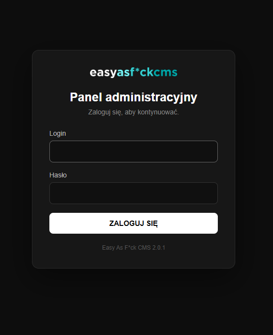
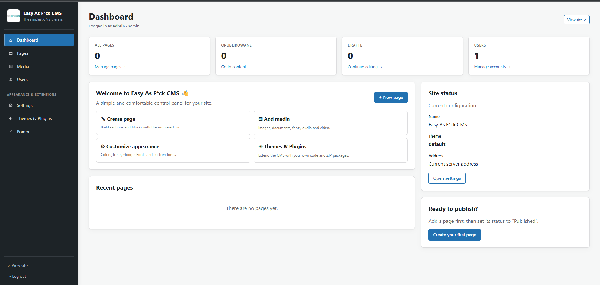
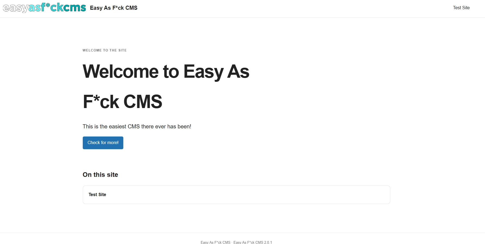

# EasyAsFckCMS

**_Easy As F*ck CMS_** is an CMS which is for people who **do not have full admin panel access** (e.g. cPanel), and **only rely on FTP access**.

Easy As F*ck CMS is also made for people which do not have a lot of IT abilities/or are new to CMS'es.

The CMS is also for people which do not know how to use e.g. WordPress, Joomla, etc. and for people who want to have easy and fast access for fast changes.

Made from total zero, using it's own engine based on PHP.

## Features
- FTP-only installation
- No cPanel required
- The simpliest administration panel there could be
- WYSIWYG page management
- Easy to read file manager
- Theme customization
- Multilingual interface (English, Polish, German, Spanish, French, Italian)
- Lightweight made from zero PHP engine

## Requirements
- PHP 7.3+
- SQLite
- FTP access

## Installation
1. Download the latest release
2. Upload files to your hosting
3. Open your website
4. Follow the installation process 

## Screenshots (screenshots of how EAFCMS looks like)

### Login Panel

### Admin Dashboard

### Main Index

## Roadmap
- [X] Added support for Google Fonts
- [ ] More themes
- [X] Better media manager
- [X] Better site WYSIWYG updater
- [X] Multilanguage support
- [X] EASFCMS version for older PHP versions (like 5.4 etc.)
- [X] Plugin support
      
## License
Easy As F*ck CMS relies on the MIT License (found in LICENSE.MD).
